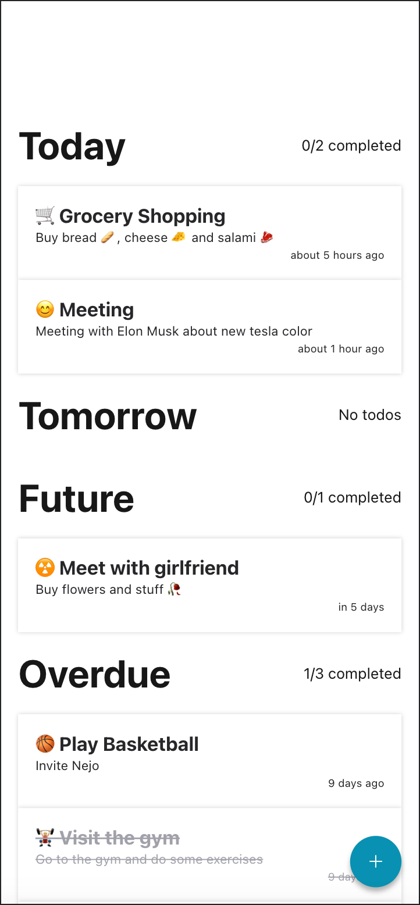
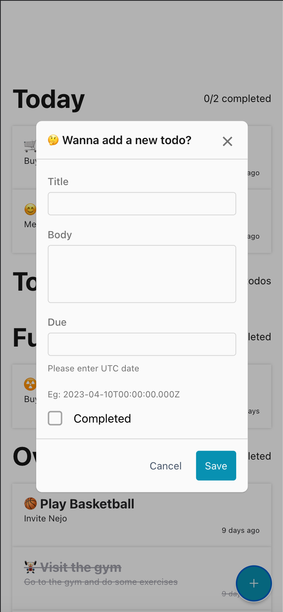
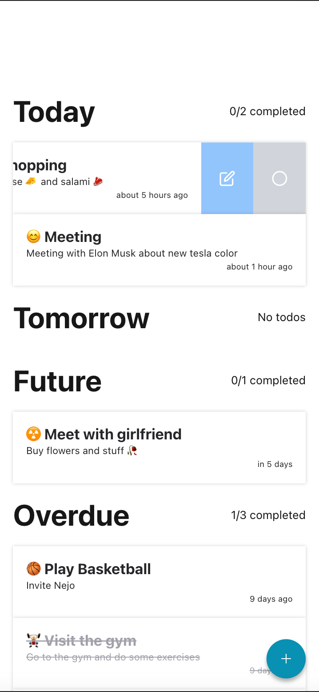
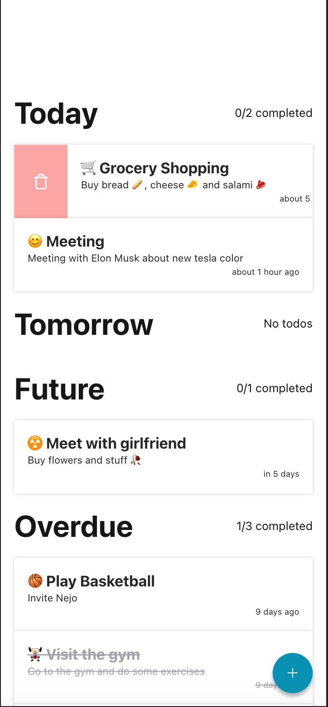
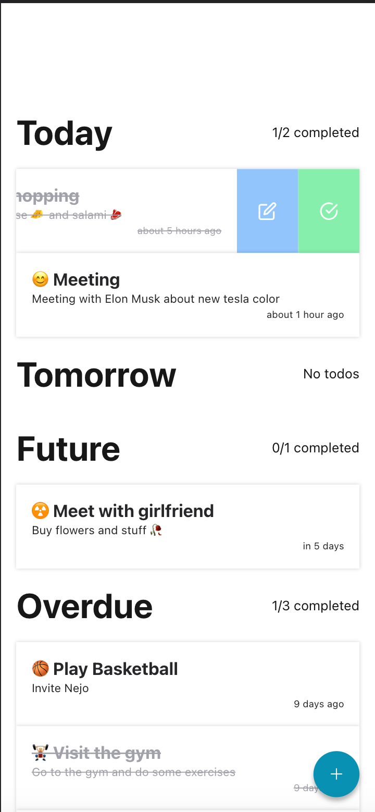
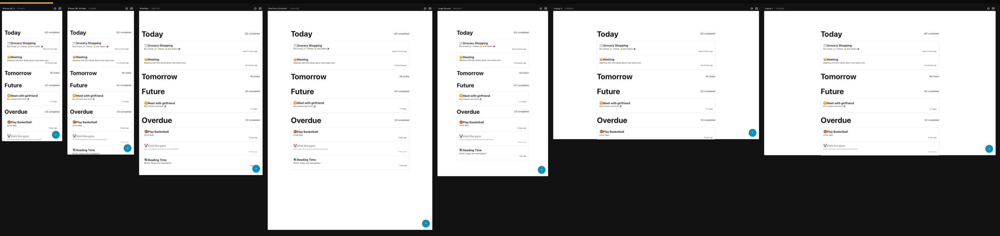

# Screenshots

| Main                   | Add Todo               | Left Swipe             | Right Swipe            | Left Swipe Done                                  |
|------------------------|------------------------|------------------------|------------------------|--------------------------------------------------|
|  |  |  |  |  |

## Responsive

# App Features
- Responsive design
- Add new todo item
- Lists all todo items
- Edit todo item
- Delete todo item
- Swipe left action to open edit and complete menu
- Swipe right to action open delete menu
- Categorize todo list by date
- Show completed todos under date
- Show remaining time for todo item in human friendly way
- Indicate completed items

# Tech Stack - Choices

## Client
- Used **Expo** makes it easy to develop and test the app on multiple platforms this app supports web/ios/android
- **NativeBase** provides pre-built UI components, which can speed up development time and it's components are web compatible
- **TypeScript** catches errors during development and provides better tooling for code navigation. Encourages developers to write better code
- **ESLint** and **Prettier** help maintain consistent code style and catch errors.

## Server
-  NestJS provides a powerful set of features that can help you build scalable and maintainable server-side applications in Node.js. It is a framework for building efficient, scalable Node.js server-side applications. It wraps Express with some additional features like dependency injection, guards, interceptors, and pipes. 
- **TypeScript** catches errors during development and provides better tooling for code navigation. Encourages developers to write better code
- **ESLint** and **Prettier** help maintain consistent code style and catch errors.
- **Prisma**  can help write type-safe, efficient, and maintainable database code, and it can save time and effort when working with databases.
- **Sqlite** is a relational database management just because it's easy to setup and use. It's also a good choice for small projects.
- **Swagger** is a powerful tool for documenting APIs. It provides a nice UI to explore the API and test it. It also provides a way to generate client code for different languages.´

- Api client generated with **OpenAPI Generator** 

# How to run the project
- Clone the project
- Run `yarn start` or `yarn start:clean` for removing cache and node_modules

# Possible Improvements if I'd have more time 
- Add tests
- Add more error handling and user feedback for better user experience

# Some answers
- React-navigation ? It's just a single screen app.
- Performance ? It might be improved by using React.memo and React.useCallback didn't focus on performance much.

## Other Details
- You can use `npx prisma studio` to view the database in a nice UI.
- Swagger is available at http://localhost:3000/api
